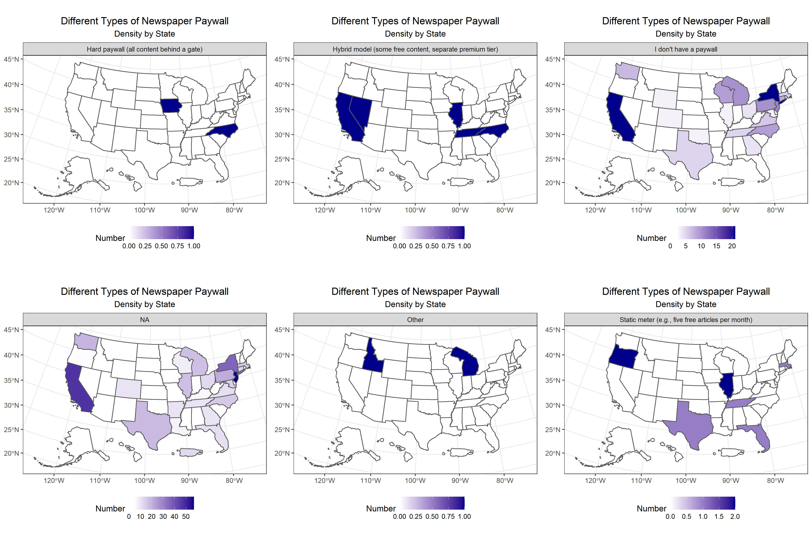

# Stat Experience

This image displays the relative density of different types of paywalls that newspapers have across the US. Recently, there has been much debate around the openness of information, especially as many right-wing media sites display their information for free while center or left-wing media sites lock their information up behind a paywall - a potentially serious issue in the information wars. Here, we can see the density of six different self-reported paywall types from newspapers across the country. Though unfortunately the only effective way to display this discrete data was along a continuous scale (which is, thankfully, different for each of the different plots), we can still see a few trends. The most common paywall type is NA, either nonexistent or not reported - seen almost everywhere in the country. Newspapers with no paywall are the next most common, seen all along the northeast and midwest with some scattered happenings out west as well. Six states had some type of static meter, the only other type of paywall to be seen more than once in any given state. North Carolina, Tennessee, Illinois, Nevada and California had papers with some sort of hybrid model, North Carolina and Iowa were the only states to list a newspaper with a hard paywall, and Idaho and Michigan had newspapers with some "other" type of paywall. In all, it seemed like the common answer was that far less news is behind paywalls than it seems, with little if any visible geographic trend in that.
